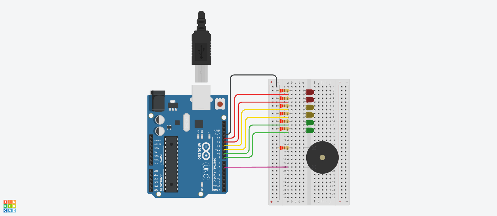

# Dojo Número Uno
## Integrantes
---
* n
* n
* n
* n 
* n
## Proyecto: Semáforo
---

## Descripción
---

## Función principal
---
~~~c++
void EncenderBinario(int estado3, int estado2,int estado1,int estado0)
{
  digitalWrite(B3,estado3);
  digitalWrite(B2,estado2);
  digitalWrite(B1,estado1);
  digitalWrite(B0,estado0);
}
~~~
## Link al proyecto
* [Proyecto](https://www.tinkercad.com/things/dH1PiQ4Je0t-tp1/editel?sharecode=0cxTDm9FAhAheCiUiBmaWy3TxTJCfUFdySkuUyj5Yv4)
---
